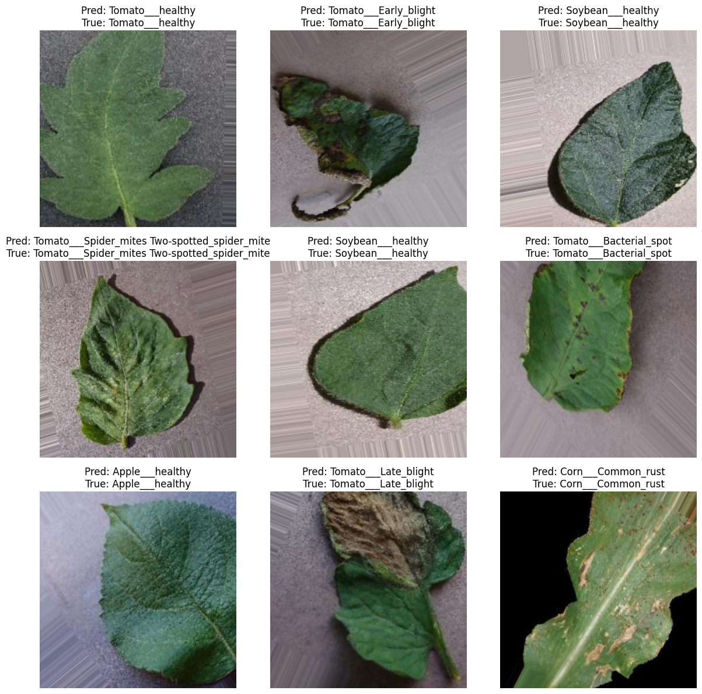

# Plant Disease Detection with MobileNetV2 🌱

## Overview

This project uses deep learning and transfer learning (MobileNetV2) to identify plant leaf diseases from images. It leverages a custom dataset of plant leaves, applies data augmentation, and fine-tunes a pre-trained model for high accuracy.

## Features

- 📦 **Dataset:** 39 plant disease classes, 44,371 training images, 11,077 validation images  
- 🧠 **Model:** MobileNetV2 with custom dense layers and dropout for regularization  
- 🔄 **Data Augmentation:** Rotation, shift, shear, zoom, and flip  
- 🏆 **Performance:** Achieves high validation accuracy with early stopping and model checkpointing  
- 📊 **Visualization:** Example predictions and training progress plots

## Project Structure

```
best_model.h5
model.ipynb
model.html / model.pdf
output.png / output2.png / output3.png
Data for Identification of Plant Leaf Diseases Using a 9-layer Deep Convolutional Neural Network/
PlantVillage/
```

## Getting Started

### 1. Clone the Repository

```sh
git clone https://github.com/reddykarthikeya1/Plant-Disease-Detection-with-MobileNetV2.git
cd Plant-Disease-Detection-with-MobileNetV2
```

### 2. Install Requirements

```sh
pip install tensorflow matplotlib numpy
```

### 3. Prepare the Dataset

- Unzip the dataset files in the `PlantVillage/` directory as shown in the structure above.

### 4. Run the Notebook

Open `model.ipynb` in Jupyter Notebook or VS Code and run all cells to train and evaluate the model.

## Model Architecture

- **Base:** MobileNetV2 (pre-trained on ImageNet, frozen for initial training)
- **Custom Head:**  
  - Dense(128, relu)  
  - Dropout(0.5)  
  - Dense(128, relu)  
  - Dropout(0.5)  
  - Dense(39, softmax)

## Training Strategy

- **Phase 1:** Train only the custom head (base model frozen)
- **Phase 2:** Fine-tune top layers of MobileNetV2 with a lower learning rate

## Example Predictions



## Results

- **Best Validation Accuracy:** ~92%  
- **Best Model Saved As:** `best_model.h5`

## References

- [MobileNetV2 Paper](https://arxiv.org/abs/1801.04381)
- [PlantVillage Dataset](https://www.kaggle.com/datasets/emmarex/plantdisease)

## License

This project is for educational purposes.

---

*Made with ❤️ by [Karthikeya Reddy](https://github.com/reddykarthikeya1)*
Read it on Medium :
https://reddykarthikeya1.medium.com/leveraging-transfer-learning-for-plant-disease-detection-with-mobilenetv2-f4762bdd8585
